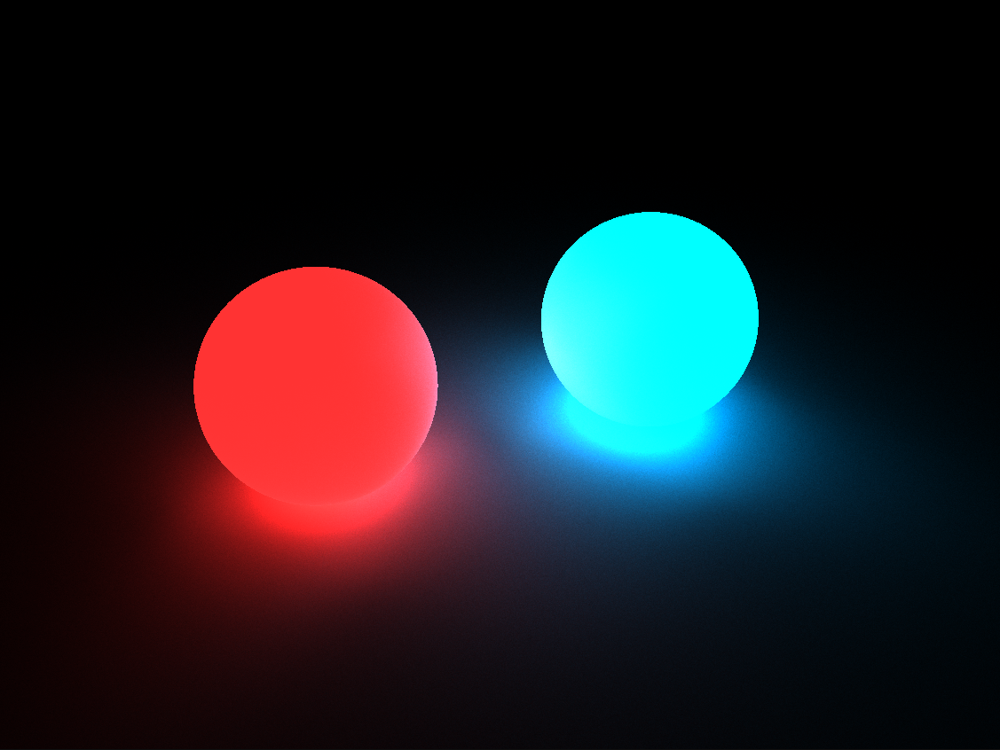
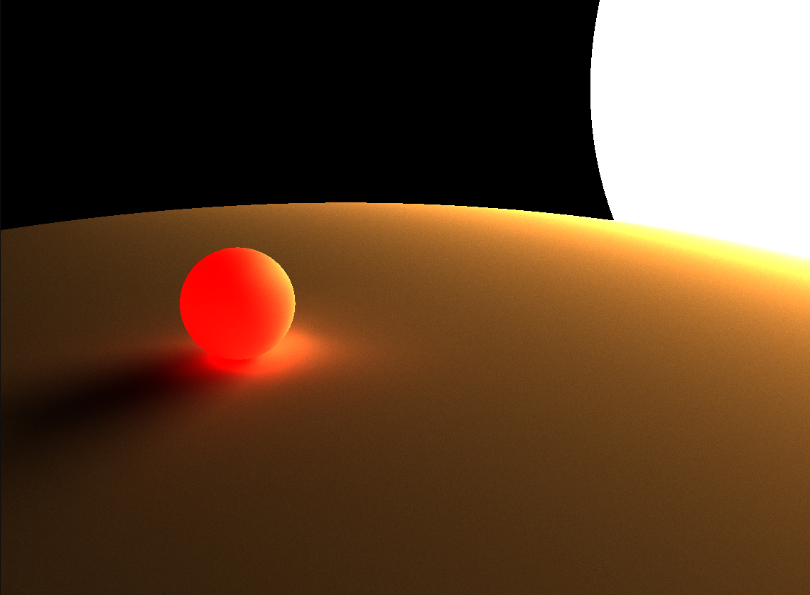
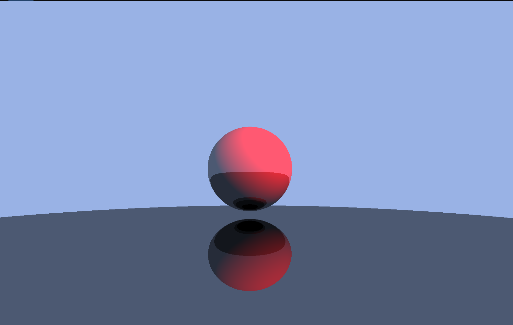

#                                           Raystalker

A multi-threaded Raytracing using C++ , Walnut GUI framework.

It's currenlty a reference for learning Ray tracing. When done with maths, will do a complete overhaul.


## Gallery



----



----



## Setup

### Prerequisites

- Vulkan SDK
- Visual studio 26 ( Recommmended)

It can work with other toolchain , but you'll have to manually set build system. 

```powershell

> git clone --recursive https://github.com/ArcShahi/RayStalker.git

# Run Setup.bat in scripts dir
> scripts\Setup.bat

# It'll generate VISUAL STUDIO solution file : Raystalker.slnx
```

>[!Warning]
> I've modified `Walnut/Random.hpp` , `Walnut/Random.cpp` to add `thread_local` in `s_RandomEngine`, so every thread get's it's own Random engine. It reduces random number generation.


## TODO
1. Option to save scene.
2. IDK something something.